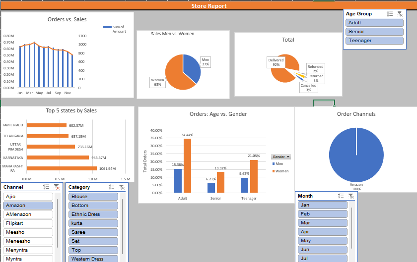

# 🛍️ Vrinda Store Data Analysis (Excel Dashboard)

An interactive Excel dashboard built to analyze sales performance, customer demographics, and order trends for **Vrinda Store**.  
This project showcases how Excel can be used effectively for **data cleaning, analysis, and visualization** to support business decision-making.

---

## 📊 Dashboard Highlights
The dashboard provides insights into:

- **Sales vs. Orders**  
  Compare revenue against the number of orders across different time periods.  

- **Men vs. Women Contribution**  
  Understand which gender drives more sales and order volume.  

- **Order Status Tracking**  
  Analyze the distribution of completed, pending, and canceled orders.  

- **Age and Gender Segmentation**  
  Explore how customer age groups interact with the store and their purchasing patterns.  

- **Seasonal Trends**  
  Identify peak months and off-seasons for sales.  

---

## 🗂️ Dataset
The Excel file includes:
- **Transactions Data** (Date, Product, Category, Customer, Gender, Age, Order Status, Quantity, and Sales).  
- Multiple **analysis sheets** such as:
  - `Sales vs. Orders`
  - `Men vs. Women`
  - `Order Status`
  - `Age and Gender`
  - `Report` (summary)
  - `Vrinda Store` (raw data)

---

## ⚙️ Excel Features Used
- Pivot Tables & Pivot Charts  
- Slicers for interactive filtering  
- Timeline filters for date-based analysis  
- Conditional Formatting  
- Drop-down filters  

---

## 📷 Dashboard Preview
> *(Add a screenshot or GIF of your dashboard here for better visibility)*  


---

## 🚀 Getting Started
1. Clone this repository:
   ```bash
   git clone https://github.com/Abhir12345/vrinda-store-dashboard.git

